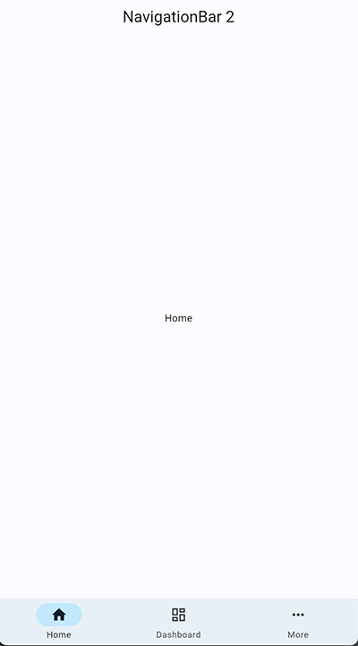
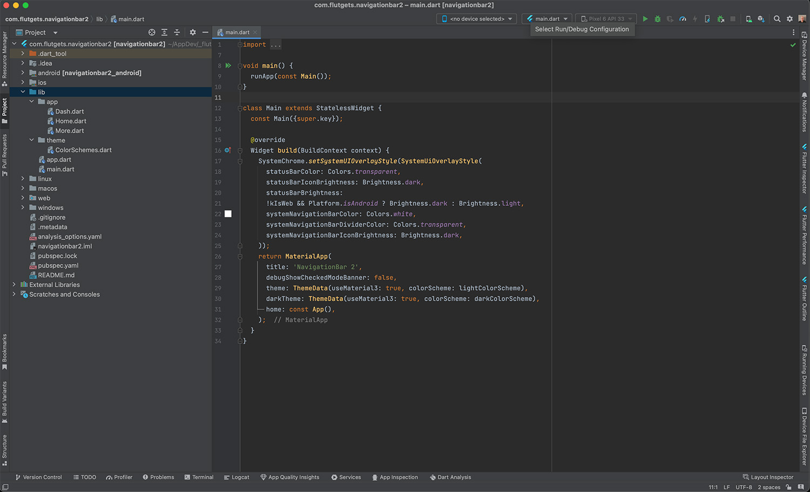

# navigationbar2

A Free Flutter project from [FlutGets.com](https://flutgets.com)

This is the Material3 NavigationBar from Flutter to start working with your new project.
I added Material3 Theming and 3 default pages to have a nice start.

- Flutter Version: 3.10.0
- Dart Version: 3.0.0
- Gradle: 8.0.1
- App Version: 1.0.0
- Released: May 20 2023
- Updated: 

View the online demo here: [WEBVIEW DEMO](https://demo.flutgets.com/navigationbar2)

# Licensing
Licensed under the Apache License, Version 2.0 (the "License");
you may not use this file except in compliance with the License.
You may obtain a copy of the License at

http://www.apache.org/licenses/LICENSE-2.0

Unless required by applicable law or agreed to in writing, software
distributed under the License is distributed on an "AS IS" BASIS,
WITHOUT WARRANTIES OR CONDITIONS OF ANY KIND, either express or implied.
See the License for the specific language governing permissions and
limitations under the License.

# Images
<b>Screenshot</b>
  

  
<b>File Structure</b>
  
 

# Support
This package comes as is, it's all Flutter / Dart code, you can use Google to find out more.

- [Lab: Write your first Flutter app](https://docs.flutter.dev/get-started/codelab)
- [Cookbook: Useful Flutter samples](https://docs.flutter.dev/cookbook)

For help getting started with Flutter development, view the
[online documentation](https://docs.flutter.dev/), which offers tutorials,
samples, guidance on mobile development, and a full API reference.
